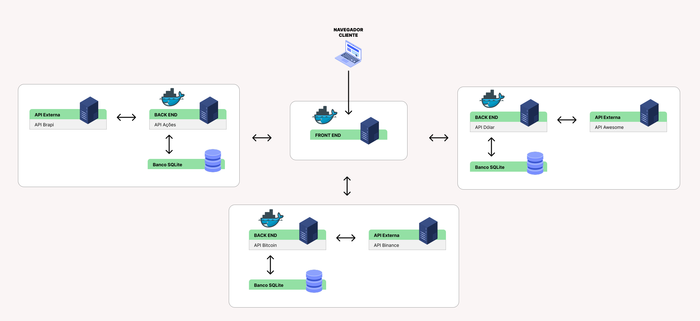

# Dashboard Financeiro



Dashboard para gestão de investimentos em ações, dólar, bitcoin e renda fixa, com visualização de gráficos e totais consolidados.

## 🚀 Instalação via Docker

1. **Pré-requisitos**:
   - Docker e Docker Compose instalados

2. **Clone o repositório**:
   ```bash
   git clone [URL_DO_REPOSITORIO]


3. **Execute o projeto**:

docker-compose up --build

4. **Acesse**:

Frontend: http://localhost:3000

APIs:

Ações: http://localhost:3003

Dólar: http://localhost:3004

Bitcoin: http://localhost:3005